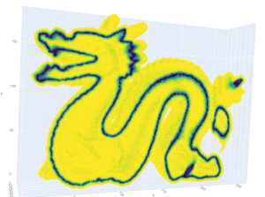

# Implementation: "Robust Reconstruction of Watertight 3D Models ..."

This is a Python implementation of the paper ["Robust Reconstruction of Watertight 3D Models from Non-uniformly Sampled 
Point Clouds Without Normal Information" by A. Hornung and L. Kobbelt](https://diglib.eg.org/bitstream/handle/10.2312/SGP.SGP06.041-050/041-050.pdf).



## TL;DR

The goal is to create a **watertight mesh** from a **point cloud**.

The core idea is that the **watertight mesh** is the the **minimum** of a 3D **distance function ϕ** to the points.

The paper proposes a **minimum solver** that solves the **minimum** of that **distance function ϕ** by using a **max-flow min-cut** through a **voxel grid**.

## Examples

There are **online interactive renders** at: https://mickare.github.io/Robust-Reconstruction-of-Watertight-3D-Models/

## How it works

1. A low resolution voxel grid is filled via a point cloud. 
2. A **boolean crust** is created by dilation & flood-filling until a watertight voxel crust is created. 
3. The **float distance values ϕ** of each crust voxel to the model point cloud is computed via diffusion 
of the point cloud.
4. A **weighted graph of ϕ** is created from the outer crust surface to the inner crust surface. 
The Maxflow-Mincut of this graph is the minimum of ϕ.
5. Either:
    - Repeat from **3. in a higher resolution** by dilating the mincut to a new crust
    - Finally **extract and smooth a mesh** from the mincut


## Requirements

Python 3.8

Conda environment that has **numba** installed.
- [Installation **numba**](https://numba.readthedocs.io/en/stable/user/installing.html)
- or `conda install --file requirements.txt`

Some files are not in the official conda channels, so they need to be installed via pip.
- `pip install -r requirements.txt`


## Usage

Run:
- [`main.py`](main.py) for running the reconstruction and show each step in the browser
- [`export.py`](export.py). for exporting a web page with each reconstruction step


### Point clouds
#### Switching the point cloud model

Change the following line in either [`main.py`](main.py) or [`export.py`](export.py).
```
example = Example.BunnyFixed
```
#### Available point clouds
Name | Description | Source | License
:--- |:---- |:------ |:-------
Bunny | Stanford Bunny | https://graphics.stanford.edu/data/3Dscanrep/ | Free but acknowledge required. 
BunnyFixed | The Bunny with addition points | https://graphics.stanford.edu/data/3Dscanrep/ | Free but acknowledge required. 
Dragon | Stanford Dragon | https://graphics.stanford.edu/data/3Dscanrep/ | Free but acknowledge required. 
Camel |  From another paper | https://people.csail.mit.edu/sumner/research/deftransfer/data.html | De Espona model library
Cat | Free cat model | https://free3d.com/3d-model/lowpoly-cat-rigged-run-animation-756268.html | Personal Use License
Dog | Free dog model | https://free3d.com/3d-model/low-poly-german-shepherd-dog-26963.html | Personal Use License


#### Custom point clouds
You can use your own models. This project has model loader implemented for `.ply` and `.pts` files.
Point clouds (like Cat and Dog) can be generated from existing wavefront `.obj` meshes.

# Code
## Voxel Data Structure

We split the voxel space into chunks, which we stored in a flat `dict` which we call [`ChunkGrid`](data/chunks.py).
Both [`Chunk`](data/chunks.py) and [`ChunkGrid`](data/chunks.py) have a fill value which is used in the case of a filled or missing chunk.
The standard math (+, -, /, *, ...) and logical (&, ^, |, ...) operators are implemented for both [`Chunk`](data/chunks.py)
and [`ChunkGrid`](data/chunks.py), and are forwarded to the internal numpy arrays or fill values.

The chunk size N³ (e.g. 16x16x16) can be configured in [`main.py`](main.py) or [`export.py`](export.py).


You can find the data structure in [`data/chunks.py`](data/chunks.py).

## Plotting
[Plotly](https://plotly.com/) is used for plotting the 3D point clouds, meshes and voxels.

The voxel mesh is created in [`render/voxel_render.py`](render/voxel_render.py).
It reduces the number of triangle faces by merging neighboring voxel faces.


# License
The code in this repository is licensed under the [MIT License](LICENSE).

The models and point clouds are each licensed from a third party and are not part of this license!
You should NOT distribute or use these models against their license.
A list of the used model licenses and source is at [models/README.md](models/README.md).
